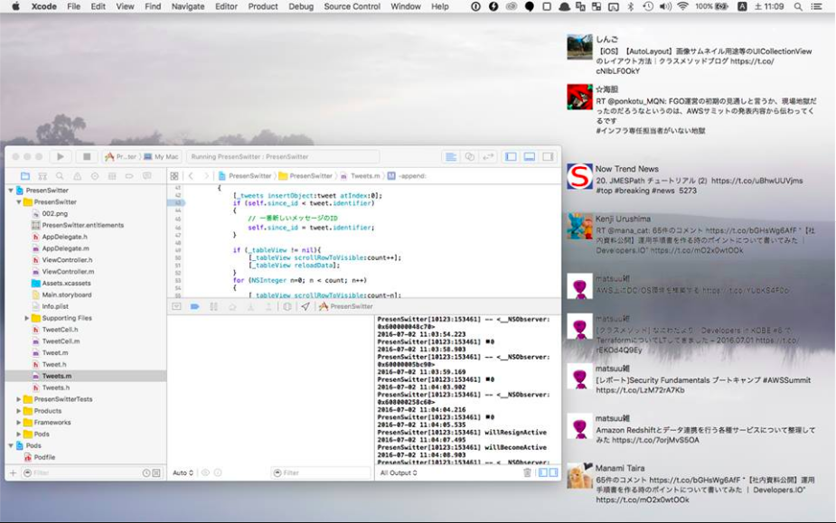

# PresenSwitter

透明Twitterクライアント

常にデスクトップで一番上に表示される、透明Twitterクライアントです。



アプリがアクティブになった時点で、ウインドウのリサイズなどの操作が可能で、非アクティブになると透過表示になります。
キー入力(+,0)でフォントの拡大縮小が可能です。

検索文字列はソースコード上で指定してください。

このアプリセーションは、プレゼン中にスライドにかぶせて、リアルタイムにTwitterのタイムラインを表示させることを目的として作成されました。


# 構築手順

## Cocoapodは、Version1.0.1で利用可能です。
```
$ pod --version
1.0.1
```

## 下記の手順でコンパイルできます。

```
$ git clone https://github.com/furuya02/PresenSwitter
$ cd PresenSwitter
$ pod install

$ xcode PresenSwitter.xcworkspace
```

## ViewController.mの下記の部分に、検索文字列・カスタマーキー・カスタマーシークレット・Twitterユーザ名・Twitterパスワードを編集してください。


```
-(void)update:(NSTimer *)theTimer
{
    // 検索文字列
    NSString *query = @"#cmdevio2016";

    NSString *ConsumerKey = @"XXXXXXXXXXXXXXXX";
    NSString *ConsumerSecret = @"XXXXXXXXXXXXXXXXXXXXXXXXXX";
    NSString *UserName = @"XXXXXX";
    NSString *Password = @"XXXXXX";
```

[[OS X] 透過型のTwitterクライアントを作ってみた](http://dev.classmethod.jp/tool/transmission-twitter-client/)

